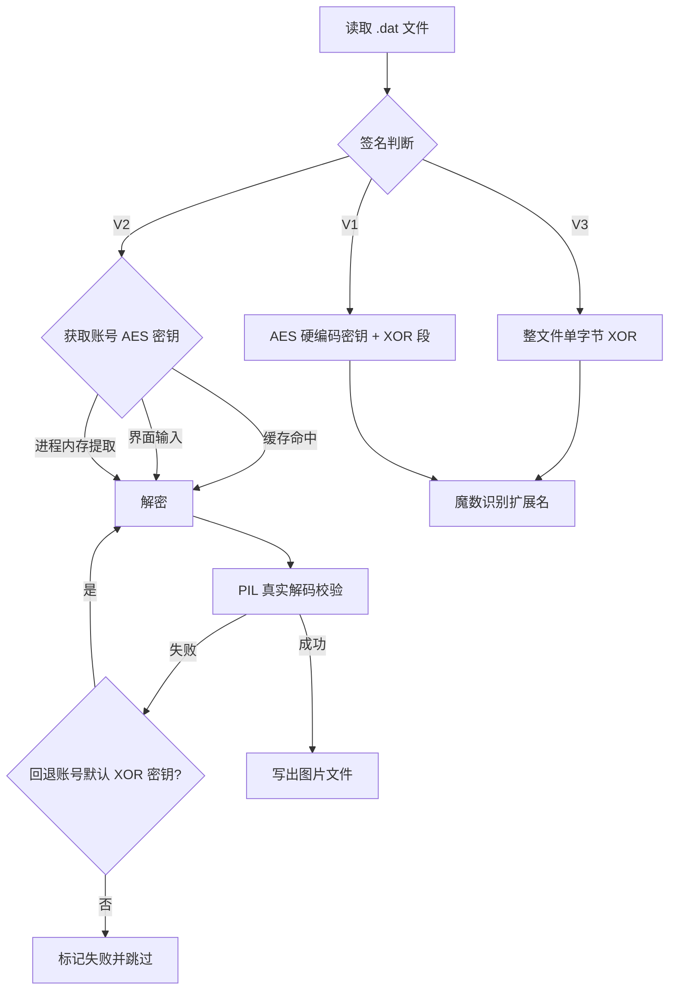

# 微信图片 dat 解密工具 (decrypt_wx_img_dat.py)

一个用于还原微信本地聊天图片 `.dat` 文件的 Python 工具，同时支持 **微信 3.x (V3)** 与 **微信 4.x (V1/V2)** 格式，内置图形界面（GUI）与命令行（CLI）两种模式。

> 本工具参考了[github.com/LifeArchiveProject/WeChatDataAnalysis](https://github.com/LifeArchiveProject/WeChatDataAnalysis)和[github.com/Evil0ctal/WeChat-image-decryption](https://github.com/Evil0ctal/WeChat-image-decryption)项目，在此表示感谢，
> 仅限于对**你自己本机**的微信图片缓存进行还原，请勿用于任何侵犯他人隐私或违反当地法律法规的场景。

---

## ✨ 功能特性

- ✅ 自动识别三种格式：**V3（微信 3.x 整文件 XOR）**、**V1（微信 4.x AES 硬编码）**、**V2（微信 4.x 账号 AES 密钥）**
- ✅ **V1 / V3 完全离线可解**，无需微信运行
- ✅ **V2** 账号密钥支持三种来源：本地缓存 → 界面手动输入 → 从运行中的微信进程内存自动提取
- ✅ 多线程批量解密，进度条 + 日志实时刷新
- ✅ 输出文件自动识别扩展名（jpg / png / gif / bmp / webp / tif / ico / heic …）
- ✅ 用 PIL 真实解码校验，避免错误密钥导致的"伪成功"

---

## 📦 安装

```bash
# Python 3.7+
pip install pycryptodome pillow
```

> - `pycryptodome`：AES 解密必需
> - `pillow`：用于解码校验（可选；缺失时自动退回仅魔数校验，可靠性下降）

---

## 🚀 使用

### 图形界面

```bash
python decrypt_wx_img_dat.py --gui
# 或直接运行（无参数默认进入 GUI）
python decrypt_wx_img_dat.py
```

### 命令行

```bash
python decrypt_wx_img_dat.py --source "D:\Documents\xwechat_files\<账号目录>" --target "D:\out"
```

| 参数             | 说明                                   |
| ---------------- | -------------------------------------- |
| `-s, --source` | 源路径（微信图片目录或单个 .dat 文件） |
| `-t, --target` | 解密输出目录                           |
| `-g, --gui`    | 启动图形界面                           |

---

## 🧬 文件格式逆向原理（核心）

### 整体结构

微信 4.x 的图片 `.dat` 并非简单 XOR，而是一个**混合加密**结构：

```
┌─────────────┬────────────────────┬──────────────────┬───────────────┐
│  15 字节头   │  AES-ECB 加密段      │  固定 16 字节标记   │  单字节 XOR 段  │
│  <6sLLx     │  aes_size 字节       │  e8f45b65...      │  xor_size 字节  │
└─────────────┴────────────────────┴──────────────────┴───────────────┘
```

### 15 字节文件头

```python
struct.unpack("<6sLLx", header)
#  6s : 签名 (6 字节)
#  L  : aes_size (小端 4 字节)
#  L  : xor_size (小端 4 字节)
#  x  : 1 字节填充
```

| 签名                   | 版本           | 说明                                          |
| ---------------------- | -------------- | --------------------------------------------- |
| `\x07\x08V1\x08\x07` | V1             | AES 密钥为**全局硬编码**常量，离线可解  |
| `\x07\x08V2\x08\x07` | V2             | AES 密钥为**当前账号密钥**，需提取/缓存 |
| 其它                   | V3（微信 3.x） | 整文件**单字节 XOR**，离线可解          |

### 三段解密流程

1. **AES 段**：取文件头之后 `aes_size`（对齐到 16 字节块）字节，用 AES-ECB 解密。

   - V1 密钥：`b"cfcd208495d565ef"`（即 `md5("0")[:16]`，硬编码常量）
   - V2 密钥：账号密钥（见下文"密钥获取"）
   - ⚠️ PKCS7 unpad 对这些文件必然失败，**保留完整 AES 段**，不做 unpad。
2. **固定 16 字节标记**：AES 段与 XOR 段之间夹着一个**恒定常量**

   ```
   e8f45b657f6d049de701465372f40b47
   ```

   它**不是图片数据**。若把它当明文拼进图片，会导致扫描数据错位、解码后整图偏色（红/黄/蓝单通道异常）。必须跳过：

   ```python
   if raw_data[:16] == V4_RAW_MARKER:
       raw_data = raw_data[16:]
   ```

   兼容两类文件：

   - `_t` 缩略图：raw 段恰好就是标记本身（16 字节）→ 整体剥掉
   - `_h` 原图：raw 段 = 标记(16) + 原始图片数据 → 只剥标记，保留图片数据
3. **XOR 段**：取末尾 `xor_size` 字节，逐字节异或单字节密钥 `xor_key`。

最终重组：

$$
\text{result} = \text{AES_decrypt}(\text{aes_data}) \;+\; \text{raw_data} \;+\; (\text{xor_data} \oplus \text{xor_key})
$$

### XOR 密钥的尾部推导

JPEG 正常以 `FF D9`（EOI 标记）结尾，因此可利用末尾两个字节反推密钥：

$$
\text{xor_key} = \text{data}\left[-2\right] \oplus \text{0xFF}
$$

并用末字节校验：

$$
\text{data}\left[-1\right] \oplus \text{0xD9} \stackrel{?}{=} \text{xor_key}
$$

### JPEG 尾部元数据页脚

微信会在 JPEG 图片末尾追加一段约 24 字节的元数据页脚（形如 `a99cc42c...`）。解密后需截断到最后一个 `FF D9`，否则严格校验会误判"密钥不正确"：

```python
if result[:3] == b"\xff\xd8\xff":
    idx = result.rfind(b"\xff\xd9")
    if idx > 0:
        result = result[: idx + 2]
```

（PNG 以 `IEND` 结尾，不受此影响。）

### ⚠️ 关键坑：XOR 密钥误判与回退

尾部推导存在**误判**风险：页脚字节可能偶然满足 `FF D9` 校验模式（实测出现过 `0xD9` / `0xFD` 的误判），导致真实密钥（账号默认，如 `0xAB`）被忽略。

因此校验不能只靠"魔数 + 尾部 FFD9"（错误密钥经页脚截断后也可能碰巧以 `FF D9` 结尾）。正确做法：

1. 用 **PIL 完整解码**（`_is_decodable_image`）确认图片真实可解；
2. 若解码失败且当前密钥 ≠ 账号默认密钥，则**回退**到账号默认密钥重试：

```python
xk = derive_xor_key_from_tail(data) or xor_key or pending_v2_xor
decrypted = decrypt_v4(data, xk, aes)

alt_xk = xor_key or pending_v2_xor
if not is_decodable_image(decrypted) and alt_xk and xk != alt_xk:
    decrypted = decrypt_v4(data, alt_xk, aes)   # 回退重试
```

---

## 🔑 V2 账号 AES 密钥获取（三级策略）

V2 文件无法离线解密，需要账号密钥。按以下顺序自动尝试：

1. **本地缓存** `wechat_image_keys.json`（同目录自动读写）
   ```json
   { "chatter_b54e": { "aes": "564551f1514c9bdc", "xor": 171 } }
   ```
2. **界面手动输入** 16 位 AES 密钥
3. **从运行中的微信进程内存自动提取**（Windows）

### 进程内存提取原理

- 定位 `Weixin.exe` / `WeChatAppEx.exe` 进程；
- 用 `VirtualQueryEx` 遍历 64 位用户空间（`0x7FFF_FFFF_FFFF`）可读区域，跳过 NULL 页与保护位异常区域；
- 用正则扫描 **16~64 位 ASCII** 字母数字串，以及 **UTF-16LE** 编码串；
- 候选密钥做两级验证：
  - **cheap_check**：对首个 AES 密文块（`data[15:31]`）做 AES-ECB 解密，魔数是否命中图片签名——快速过滤；
  - **full_check**：用该密钥完整解密模板文件，PIL 校验——最终确认。

> 需要：微信正在运行 + 脚本以管理员权限运行（读取进程内存）。

---

## 🔄 解密流程总览



---

## ⚠️ 已知限制

- **V2 文件必须要有账号 AES 密钥**；进程内存提取依赖微信运行与管理员权限，且不同微信版本内存布局可能变化，不保证 100% 命中。
- 少量缩略图（`_t`）文件本身是**损坏/不完整**的源数据（接收时下载中断），任何密钥都无法解码，属正常现象。
- 微信 4.x 版本更新可能调整格式（如签名、标记、密钥派生方式），需按新格式适配。

---

## 🛡️ 免责声明

仅用于**个人本地数据备份与恢复**，请在合法合规的前提下使用。用户应对使用本工具的行为及其后果自行负责，请勿用于窃取、传播他人隐私等非法用途。

---

## 📄 License

MIT License
